# Project Aurora: Architectural Overview

This document describes the high-level architecture and design patterns of Project Aurora.

## 🏗 System Structure

Aurora follows a decoupled, multi-project architecture designed for maximum code reuse, testability, and cross-platform flexibility.

### Solution Projects

```
Project-Aurora.sln
├── src/
│   ├── Aurora (MAUI Application)
│   ├── Aurora.Client.Core (Business Logic)
│   ├── Aurora.Client.Core.Tests (Unit Tests)
│   ├── Aurora.Shared (Contracts & Models)
│   ├── Aurora.Api (Azure Functions Backend)
│   ├── Aurora.Api.Tests (API Unit Tests)
│   └── SchemaBuilder (Build Tool)
└── tools/
    └── AzuriteSetup (Local Development Tool)
```

### Component Map

1.  **`src/Aurora` (.NET MAUI Application)**
    - **Purpose:** Cross-platform UI layer (Android, iOS, Windows, macOS)
    - **Framework:** .NET 9 with MAUI workload
    - **Responsibilities:**
      - Platform-specific lifecycle management
      - XAML-based UI rendering and navigation
      - Code-behind for interaction logic
      - Platform abstraction (Android emulator vs physical device networking)
    - **Dependencies:** `Aurora.Client.Core`, `Aurora.Shared`

2.  **`src/Aurora.Client.Core` (.NET 9 Class Library)**
    - **Purpose:** Framework-independent business logic
    - **Responsibilities:**
      - Service implementations (`ContentService`)
      - HTTP communication with backend API
      - Data transformation and caching logic
      - Optimistic UI update strategies
    - **Dependencies:** `Aurora.Shared`, `System.Net.Http`
    - **Why Separate:** Enables unit testing without MAUI framework dependencies

3.  **`src/Aurora.Shared` (.NET 9 Class Library)**
    - **Purpose:** Shared data contracts between client and server
    - **Responsibilities:**
      - Data models (`ContentItem`, `ContentFeed`)
      - Service interfaces (`IContentService`)
      - Reactive UI models (`INotifyPropertyChanged` implementations)
    - **Dependencies:** None (pure models and interfaces)
    - **Why Separate:** Ensures client/server data contract consistency

4.  **`src/Aurora.Api` (Azure Functions - .NET 9 Isolated Process)**
    - **Purpose:** Serverless HTTP API backend
    - **Responsibilities:**
      - Content delivery from Azure Blob Storage
      - Reaction persistence via Azure Table Storage
      - Retry resilience with Polly policies
      - Structured logging to Application Insights
    - **Dependencies:** `Aurora.Shared`, `Azure.Storage.Blobs`, `Azure.Data.Tables`, `Polly`
    - **Deployment:** Azure Functions Consumption Plan (Linux)

5.  **`src/Aurora.Client.Core.Tests` (xUnit .NET 9)**
    - **Purpose:** Unit tests for client business logic
    - **Test Strategy:** Mocked `HttpMessageHandler` for `ContentService` testing
    - **Dependencies:** `Aurora.Client.Core`, `Moq`, `xUnit`

6.  **`src/Aurora.Api.Tests` (xUnit .NET 9)**
    - **Purpose:** Unit tests for API services
    - **Test Strategy:** Mocked Azure SDK clients (`TableServiceClient`)
    - **Dependencies:** `Aurora.Api`, `Moq`, `xUnit`

7.  **`src/SchemaBuilder` (Console App - .NET 9)**
    - **Purpose:** Build-time schema generation tool
    - **Responsibilities:**
      - Generates `content.schema.json` from C# models
      - Runs automatically on build via MSBuild PostBuildEvent
      - Prevents data contract drift between frontend/backend
    - **Dependencies:** `Aurora.Shared`, `Newtonsoft.Json`, `NSwag.Core`

8.  **`tools/AzuriteSetup` (Console App - .NET 9)**
    - **Purpose:** Local development environment automation
    - **Responsibilities:**
      - Creates `aurora-content` container in Azurite
      - Uploads `sample.content.json` to local blob storage
      - Eliminates manual Azure Storage Explorer setup
    - **Dependencies:** `Azure.Storage.Blobs`

### Project Dependency Graph


## ⚙ Key Architectural Patterns

### Service Testability & Decoupling
To avoid the complexities of testing within a mobile framework, all core logic is isolated in `Aurora.Client.Core`. 
- **Typed Clients:** We use the `HttpClient` Factory pattern in `MauiProgram.cs` to inject pre-configured clients into our services.
- **Interface Segregation:** The UI depends on interfaces from `Aurora.Shared`, allowing for easy mocking during UI development or testing.

### Cloud-Native Persistence (Local & Remote)
For handling user reactions, we utilize **Azure Table Storage** for its performance and cost-effectiveness.
- **Abstraction:** The `ReactionStorageService` encapsulates all database interactions, preventing leakage of storage concerns into the HTTP trigger layer.
- **Local Development:** We use **Azurite**, an open-source emulator, to mirror the Azure Table Storage API locally. This ensures our "Cloud Native" code works offline without modification.

### Automated Schema Synchronization
We treat our C# models as the "Single Source of Truth." 
- The `SchemaBuilder` project is integrated into the build process.
- Whenever the solution is built, the JSON schema for our content is updated, preventing "drift" between the backend expectations and the frontend implementation.

### Platform-Specific Networking
To accommodate the unique networking environment of mobile emulators (specifically Android's `10.0.2.2` loopback), we utilize platform-detection logic within our Dependency Injection setup to automatically remap local API calls to the correct host machine interface.

### Reactive UI Models
To ensure a responsive and "live" user experience, especially during interactive operations like reactions, we utilize the **Observer Pattern** via `INotifyPropertyChanged`. 
- **Automatic Sync:** Data models in `Aurora.Shared` that are bound to the UI implement this interface. 
- **Direct Interaction:** This allows service-layer updates (like an optimistic increment or a server confirmation) to reflect instantly in the UI without the need for manual view-model or collection refreshes.

## 📊 Data Flow

### Content Delivery Flow (Read Path)

```mermaid
sequenceDiagram
    participant User
    participant UI as Aurora UI<br/>(XAML)
    participant Service as ContentService<br/>(Client.Core)
    participant API as GetDailyContent<br/>(Azure Function)
    participant Blob as Azure Blob Storage<br/>(aurora-content)

    User->>UI: App Launch
    UI->>Service: GetDailyContentAsync()
    Service->>API: GET /api/GetDailyContent

    API->>Blob: DownloadContentAsync("content.json")
    Note over API,Blob: Polly retry: 3 attempts<br/>Exponential backoff (1s, 2s, 4s)

    alt Success
        Blob-->>API: content.json (JSON)
        API-->>Service: 200 OK + ContentFeed JSON
        Service->>Service: Deserialize JSON<br/>(snake_case → PascalCase)
        Service-->>UI: ContentFeed object
        UI->>UI: Data Binding Update
        UI-->>User: Display Vibe + Daily Picks
    else Blob Not Found
        Blob-->>API: 404 Not Found
        API-->>Service: 404 "Content not yet published"
        Service-->>UI: Error Message
    else Storage Error
        Blob-->>API: 500 Storage Failure
        API->>API: Retry (3 attempts)
        alt Retry Success
            Blob-->>API: content.json
            API-->>Service: 200 OK
        else Retry Exhausted
            API-->>Service: 500 "Storage configuration error"
            Service-->>UI: Error Message
        end
    end
```



### Reaction Flow (Write Path)


### Build-Time Schema Generation


### Local Development vs Production Data Flow

**Local Development (Azurite):**
```
Aurora UI → ContentService → localhost:7071/api/GetDailyContent
                                        ↓
                              Azure Functions Core Tools (func start)
                                        ↓
                              GetDailyContent function
                                        ↓
                              BlobServiceClient (UseDevelopmentStorage=true)
                                        ↓
                              Azurite (127.0.0.1:10000)
                                        ↓
                              Local blob: aurora-content/content.json
```

**Production (Azure):**
```
Aurora UI → ContentService → https://func-aurora-beta-4tcguzr2.azurewebsites.net/api/GetDailyContent
                                        ↓
                              Azure Functions (Linux, Consumption Plan)
                                        ↓
                              GetDailyContent function
                                        ↓
                              BlobServiceClient (Azure connection string)
                                        ↓
                              Azure Blob Storage (staurora4tcguzr2zm32w)
                                        ↓
                              Cloud blob: aurora-content/content.json
```

## ☁️ Cloud Deployment Architecture

### Azure Infrastructure (Production)

Aurora's cloud infrastructure is deployed to **Azure (East US region)** using a **serverless, consumption-based** architecture to minimize operational costs during beta testing.

**Resource Group:** `rg-aurora-beta`

#### Compute Layer
- **Azure Functions** (Consumption Plan - Y1 SKU)
  - Serverless, pay-per-execution model ($0/month for beta usage under 1M executions)
  - .NET 9 isolated process runtime
  - Linux hosting environment
  - Auto-scales 0-3 instances based on load
  - CORS configured for mobile application access

**Endpoints:**
- `GET /api/GetDailyContent` - Serves content feed from Azure Blob Storage with retry logic
- `POST /api/articles/{id}/react` - Increments reaction counts in Table Storage

#### Storage Layer
- **Azure Table Storage**
  - NoSQL key-value store for reaction counts
  - Table: "Reactions" (PartitionKey: article ID, RowKey: "uplift")
  - Provides global persistence across all users and sessions
  - Cost: ~$0.045/GB/month (expecting <100MB for beta)

- **Azure Blob Storage**
  - Container: `aurora-content` (private access)
  - Stores `content.json` for dynamic content delivery (updates without API redeployment)
  - Implements Polly retry policy (3 attempts, exponential backoff) for resilience
  - Local development uses Azurite emulator (`UseDevelopmentStorage=true`)
  - Cost: ~$0.02/GB/month (~$0.0004 per 10K read operations)

#### Monitoring Layer
- **Application Insights**
  - Telemetry collection for Function App performance and errors
  - Integrated Log Analytics workspace for query and analysis
  - Enables cold start monitoring, exception tracking, and usage analytics

### Deployment Model

**Infrastructure as Code:**
- Bicep templates define all Azure resources declaratively
- Modular structure: `main.bicep` orchestrates storage, monitoring, and compute modules
- Parameterized for environment-specific configuration (beta, production)
- PowerShell deployment script (`deploy.ps1`) handles validation and deployment

**Code Deployment:**
- Azure Functions code deployed via `func azure functionapp publish`
- MAUI application uses environment-specific configuration:
  - **Debug builds:** `appsettings.Development.json` → localhost API (local development)
  - **Release builds:** `appsettings.json` → Azure Functions API (cloud-connected)

### Network Architecture

**Mobile Client → Cloud API:**
- MAUI app communicates with Azure Functions over HTTPS
- Release builds hardcode production API URL (no runtime discovery)
- Debug builds use localhost with platform-specific remapping (Android emulator: 10.0.2.2)

**Azure Functions → Table Storage:**
- Functions use managed service connection strings configured via App Settings
- No public internet traversal (Azure backbone network)
- Connection string injected at runtime via environment variables

### Security Model

**API Authentication:**
- Currently anonymous (no user accounts in MVP)
- CORS restricts requests to mobile application origins only
- HTTPS enforced for all endpoints

**Storage Security:**
- Table Storage accessed via connection string (secured in Function App settings)
- Blob Storage private access (no public listing or direct access)
- Connection strings never committed to source control

### Cost Profile (Beta Phase)

**Current Monthly Cost:** ~$0-5/month
- Consumption Plan: $0 (under 1M free executions)
- Table Storage: ~$0.05 (minimal data volume)
- Blob Storage: ~$0.02 (single content file)
- Application Insights: Free tier (5GB ingestion/month)

**Quota Allocation:**
- Y1 VMs (Consumption Plan): 3 instances (supports auto-scaling)
- Sufficient for beta testing with <100 concurrent users

### Disaster Recovery

**Stateful Components:**
- Reaction counts in Table Storage (persistent, replicated within region)
- Content JSON in Blob Storage (planned for V-0.3, replicated)

**Stateless Components:**
- Azure Functions (redeployable from source in <5 minutes)
- Infrastructure (redeployable from Bicep templates in <3 minutes)

**Backup Strategy:**
- Infrastructure templates in source control provide "restore from scratch" capability
- Table Storage data backed up via Azure's geo-redundant storage (GRS)
- No manual backup processes required for beta phase

### Observability

**Telemetry Streams:**
- Application Insights captures:
  - HTTP request/response telemetry (latency, status codes)
  - Exception tracking and stack traces
  - Custom events (future: reaction submissions, content loads)
  - Cold start metrics for Consumption Plan performance

**Monitoring Access:**
- Azure Portal → Application Insights dashboard
- Log Analytics queries for advanced troubleshooting
- Real-time metrics for function execution and failures
